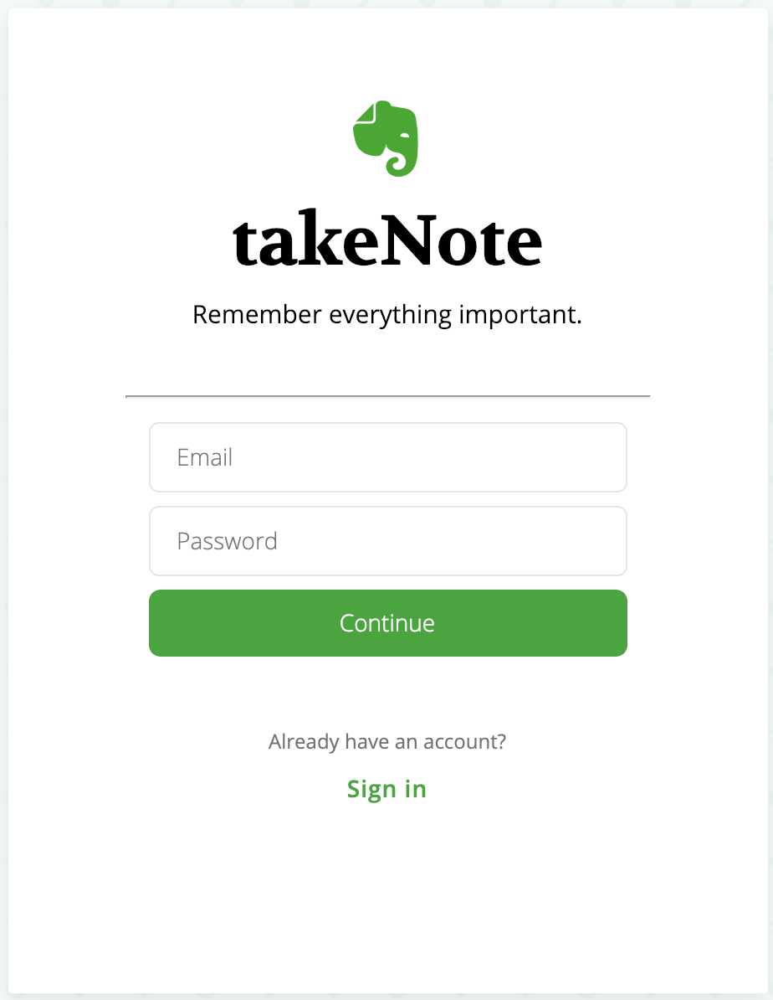

# takeNote
Welcome to takeNote. takeNote is a single-page clone of Evernote, a web application designed for note taking and organizing notes and notebooks. takeNote allows users to create and edit notes in Rich Text Format (RTF). Notes can be saved into a notebook, edited, and searched. 

[takeNote Live](https://takenoteapp.herokuapp.com)

## Technologies
takeNote is built using Ruby on Rails (backend data management), SQL database, HTML/CSS, JavaScript, and React/Redux (frontend).

## Key Features
User Authentication
Users can create an account by providing an email address and password. Users can then log in and access their notes and notebooks.

## Rich-text Editing
Users can create, edit, and save notes with full rich text.

## Notebooks
Users can organize notes into notebooks and sort notebooks by date updated.

## Search Notebooks
Users can search for specific notebooks by title.

